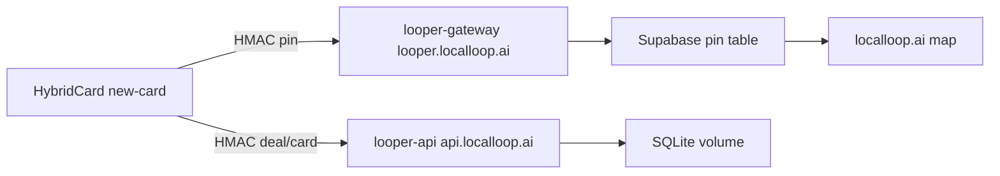

# Get Looper + bridge online

> **Status:** executed 2026-07-21 (public path live).  
> **Live:** `https://api.localloop.ai/health` · pin bridge `https://looper.localloop.ai/api/bridge/pin`  
> **Origin note:** CF Worker proxies to a local cloudflared tunnel until Coolify password is reset and Docker origin is deployed.  
> **Related:** [evidence/F9.1/README.md](evidence/F9.1/README.md), [features/10-deploy.md](features/10-deploy.md), [features/02-bridge-receivers.md](features/02-bridge-receivers.md).

## Overview

Get Looper API live on Coolify at `api.localloop.ai`, then wire HybridCard → Looper ingest + LocalLoop pin bridge so deals flow online. Defer TypeDB Cloud, voice, news, and districts (later phases).

## Checklist (when executing)

- [x] Sanitize `.env.example` placeholders; sync `main` with origin without committing secrets
- [x] Public `api.localloop.ai` (CF Worker `looper-api` + tunnel origin; Coolify UI blocked — reset login)
- [x] Align new-card `.env.local` + worker `LOCALLOOP_BRIDGE_SECRET` + KV; Coolify new-card paste sheet in `secrets/new-card-bridge-coolify.env`
- [x] HTTPS health + signed ingest + pin draft smoke; evidence in `plans/evidence/F9.1/`

## Scope (this pass)

**In:** Coolify `looper-api` on `api.localloop.ai`, bridge secrets, HybridCard drain URLs, Cloudflare worker pin path, one signed smoke deal.

**Out:** TypeDB Cloud brain (Phase 2), voice/Jarvis, news TTS, loop-onboard, full F9.3 checklist items 3–7.

## Preconditions

- Coolify: `http://167.86.79.151:8000` (`secrets/looper-coolify.env`)
- Image ready: `backend/Dockerfile` — `uvicorn` on `0.0.0.0:8000`, `/health` check
- Compose pattern: `docker-compose.yml`
- Repo: `https://github.com/localloop-pro/looper.git` — do not deploy dirty local secrets

## Step 1 — Repo hygiene (before Coolify build)

1. Sanitize tracked `.env.example`: strip real Twilio/Mongo/Minimax/bridge values back to placeholders only (keep TypeDB *placeholder* keys).
2. Sync with `origin/main` carefully (pull/rebase or merge) without committing secrets from `.env.local` / `secrets/`.
3. Confirm Coolify will build with **Dockerfile context = `backend/`** (not repo root).

## Step 2 — Coolify: create `looper-api` (F9.1 slice)

On Coolify (`167.86.79.151`):

| Setting | Value |
|---------|--------|
| Source | `localloop-pro/looper` GitHub |
| Build | Dockerfile at `backend/Dockerfile` |
| Port | `8000` |
| Domain | `api.localloop.ai` |
| Volume | persist `/app/data` (SQLite) |

Env on the service:

- `LOOPER_DB_URL=sqlite:///data/looper.db`
- `HYBRIDCARD_INGEST_SECRET=<openssl rand -hex 32>` (generate once; store in password manager + Coolify)
- `HYBRIDCARD_KEY_IDS=hc-1`

DNS: Cloudflare A/CNAME for `api.localloop.ai` → Coolify/Traefik (same pattern as existing localloop services).

**Accept:** `curl https://api.localloop.ai/health` → `{"status":"healthy"}` and `/docs` loads over HTTPS.

## Step 3 — Wire the bridge senders (F9.2 / F1.5 staging→prod)

**A. Cloudflare worker** (`workers/looper-gateway` in llx11):

- Ensure `LOCALLOOP_BRIDGE_SECRET` is set (`wrangler secret put`)
- Confirm `https://looper.localloop.ai/api/bridge/pin` is the live route (GET `/api/bridge` may 404 — POST `/pin` is the contract)

**B. HybridCard `new-card` Coolify env** (staging first, then prod only with Bill go-ahead — F9.4 hot zone):

- `LOOPER_INGEST_URL=https://api.localloop.ai/api/ingest/hybridcard-deal`
- `LOOPER_CARD_INGEST_URL=https://api.localloop.ai/api/ingest/hybridcard-card`
- `HYBRIDCARD_INGEST_SECRET=<same as looper-api>`
- `LOCALLOOP_BRIDGE_URL=https://looper.localloop.ai/api/bridge`
- `LOCALLOOP_BRIDGE_SECRET=<same as worker>`
- Coolify cron every minute: `POST /api/internal/bridge/drain` with `x-cron-secret`

**C. Local mirror:** add `HYBRIDCARD_INGEST_SECRET` to gitignored `.env.local` (must not live only as `LOCALLOOP_BRIDGE_*`).

## Step 4 — Smoke (minimal F9.3)

1. Health: `https://api.localloop.ai/health`
2. Signed test deal (`backend/tests/send_signed_event.py` against prod URL + secret) → row in `bridge_events` / business+deal
3. Drain (or wait for cron) → draft pin in Supabase `pending_review`
4. Bill approves pin in Supabase → marker on map
5. Archive evidence under `plans/evidence/F9.1/` (or extend F1.5), tick F1.5 + F9.1 looper-api row when green

## Step 5 — Explicitly not in this pass

- TypeDB Cloud (`TYPEDB_ADDRESS` empty) — keep `TYPEDB_ENABLED=false`
- Voice / news / districts / Ricky cockpit
- Flipping HybridCard **prod** outbound flags without a green staging smoke (F9.4)

## Hot-zone rules

Deploys, prod secret writes, and Supabase pin approval are Bill-gated. Agent drives Coolify UI / wrangler / curls with Bill present; no force-push; no committing secrets.
